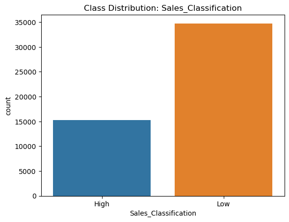
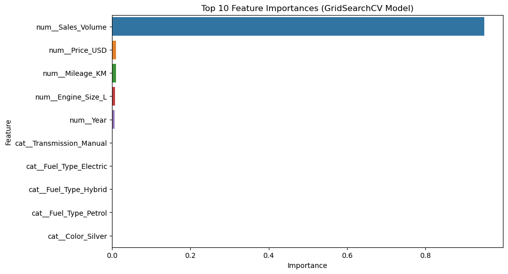

# BMW Sales EDA & Classification

  

**Author:** Anastasiya Safonova  
**Date:** 2025  

**Description:** Exploratory Data Analysis of BMW sales (2010–2024) and a classification model to predict sales level (`High` / `Low`).

---

## Business Context & Problem Statement

### **Goal**  
To predict whether a BMW model will achieve **high** or **low** sales, supporting data-driven decisions in **inventory**, **marketing**, and **financial strategy**.  
A **Random Forest** classification model was developed using technical and market-related vehicle features.

---

### **Key Challenges**  
- **Imbalanced target classes**, with significantly more low-selling models.  
- **Potential data leakage** due to strong correlation between `Sales_Volume` and `Sales_Classification`.  
- **Weak predictive power** of remaining independent features after target definition.  

---

### **Tech Stack**  
- **Language:** Python  
- **Libraries:** `pandas`, `numpy`, `scikit-learn`, `matplotlib`, `seaborn`  
- **Model:** Random Forest Classifier  
- **Techniques:** feature engineering, class balancing, hyperparameter tuning, model evaluation (`ROC-AUC`, `F1-score`), and data leakage analysis  


---

## Dataset Overview

- Source: [BMW Worldwide Sales Records (2010–2024) on Kaggle](https://www.kaggle.com/datasets/ahmadrazakashif/bmw-worldwide-sales-records-20102024)  
- ~50,000 records  
- Key features: `Model`, `Year`, `Engine_Size_L`, `Transmission`, `Fuel_Type`, `Color`, `Mileage_KM`, `Price_USD`, `Region`  
- Target variable: `Sales_Classification` (High / Low)

---
## Project Structure
```
bmw-sales-eda-classification/
├── data/                 # Raw CSV datasets
├── images/               # Figures for README
├── notebooks/            # Jupyter notebooks
│   └── bmw_sales_analysis.ipynb
├── requirements.txt      # Python dependencies
├── README.md             # Project documentation
└── LICENSE               # License file
```

---

## Evaluation Metrics

Since the target variable is **imbalanced**, the model’s performance is evaluated mainly using:

| Metric       | Description |
|-------------|-------------|
| F1 Score     | Harmonic mean of Precision & Recall; balances false positives and false negatives. |
| Precision    | Proportion of predicted `High` sales that are correct. |
| Recall       | Proportion of actual `High` sales correctly identified. |
| ROC AUC      | Ability to distinguish between `High` and `Low` classes. |

**Note:** Accuracy is shown for reference but can be misleading due to class imbalance.

---

## Modeling Summary

| Model                       | Accuracy | F1  | ROC AUC |
|-----------------------------|---------|-----|---------|
| Baseline (with Sales_Volume) | 1.00    | 1.0 | 1.0     |
| GridSearch (with Sales_Volume)| 1.00   | 1.0 | 1.0     |
| Baseline (without Sales_Volume)| 0.57  | 0.56| 0.50    |
| GridSearch (without Sales_Volume)| 0.69| 0.68| 0.50    |

**Feature Engineering Highlights:**  
- `Year` → `Years_Since_First_Sale`  
- Standard scaling for numeric features  
- One-hot encoding for categorical features  

---

## Key Findings
- The target is **imbalanced**, requiring `class_weight='balanced'`.  
- `Sales_Volume` almost perfectly separates classes → **potential data leakage**.  
- Removing `Sales_Volume`, performance drops (Accuracy ~0.57–0.69, ROC AUC ~0.5).  
- Remaining features alone are insufficient for accurate classification, highlighting the importance of feature selection.

---

##  Mini EDA Visualizations

**Target Distribution**
  

**Sales_Volume vs Sales_Classification (Boxplot)**
  

*Observation:*  
`Sales_Volume` shows an almost perfect separation between *Low* and *High* sales classes,  
indicating a potential **data leakage** — a finding later confirmed through modeling.

**Top 10 Feature Importances (GridSearchCV Model) with `Sales_Volume`**


*Observation:*  
`Sales_Volume` overwhelmingly dominates the model, confirming potential **data leakage**.  
Other features contribute very little to the prediction.


---

## How to Run
1. **Clone the repository to your local machine and navigate into the project directory:**
   ```bash
   git clone https://github.com/Safonovanastya87/bmw-sales-eda-classification.git
   cd bmw-sales-eda-classification
   ```
   

2. **Install requirements:**
   ```bash
   pip install -r requirements.txt
   ```

3. **Make sure you also have `opendatasets` installed. If not, install it:**
    ```bash
    pip install opendatasets
    ```

4. **Open the Jupyter Notebook:**
    ```bash
    jupyter notebook notebooks/bmw-sales-eda-classification.ipynb
    ```

5. **Download the dataset:**
The BMW Worldwide Sales dataset is hosted on Kaggle and is **not included** in this repository.  

You can download it automatically in the notebook using your Kaggle account and API token (`kaggle.json` in `~/.kaggle/` or `%USERPROFILE%\.kaggle\`):

   ```python
   import opendatasets as od

   url = "https://www.kaggle.com/datasets/ahmadrazakashif/bmw-worldwide-sales-records-20102024/data"
   od.download(url)
   ```
This will download the dataset folder bmw-worldwide-sales-records-20102024 in your current working directory.

6. **Load the dataset in Jupyter Notebook:**
   ```python
   import pandas as pd

   df_bmw_sales = pd.read_csv("bmw-worldwide-sales-records-20102024/BMW sales data (2010-2024) (1).csv")
   df_bmw_sales.head()
   ```
Make sure the path matches the downloaded folder. If you move the CSV to another location (e.g., data/raw/), update the path accordingly.

  
## License

This project is licensed under the **MIT License** - see the [LICENSE](LICENSE) file for details.


