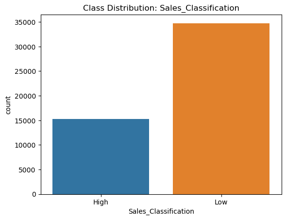
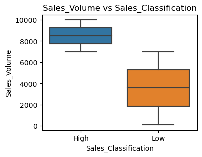
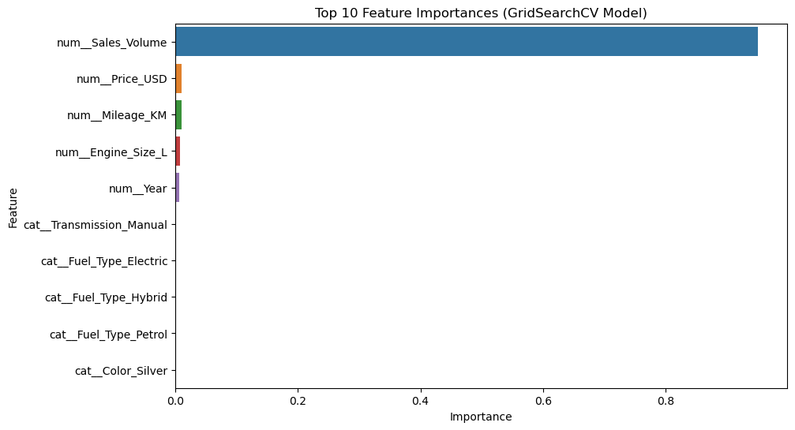

# BMW Sales Classification: A Case Study in Data Leakage Detection


 
 


**Author:** Anastasiya Safonova
**Date:** 2025

---

## Project Overview

This project investigates a binary classification problem using BMW sales data from 2010–2024.

The initial objective was to build a machine learning model capable of classifying sales records into **High** and **Low** sales categories based on vehicle characteristics and sales-related attributes.

During exploratory analysis, the feature `Sales_Volume` exhibited an unusually strong relationship with the target variable. Models trained using all available features achieved near-perfect performance, prompting further investigation into potential data leakage.

To evaluate the robustness of the results, two modeling approaches were compared:

1. Models trained using all available features.
2. Models trained after removing the potentially leaking feature (`Sales_Volume`).

The project demonstrates how data leakage can artificially inflate model performance and highlights the importance of exploratory analysis, feature validation, and model interpretation when developing machine learning solutions.

---

## Dataset Overview

**Dataset:** BMW Sales Data (2010–2024)

* Source: Kaggle
* Author: Youssef Kandil
* Records: 50,000 observations
* Target Variable: `Sales_Classification` (High / Low)

### Features

* Model
* Year
* Region
* Color
* Fuel_Type
* Transmission
* Engine_Size_L
* Mileage_KM
* Price_USD
* Sales_Volume

Dataset URL:

https://www.kaggle.com/datasets/y0ussefkandil/bmw-sales2010-2024

---

## Business Objective

The primary objective is to determine whether vehicle and sales-related attributes can be used to predict sales performance.

A secondary objective is to investigate the influence of highly predictive variables and assess whether model performance remains robust after removing potentially leaking features.

---

## Key Challenges

* Moderately imbalanced target classes
* Potential data leakage caused by `Sales_Volume`
* Limited predictive signal in the remaining features
* Validation of model robustness through feature-removal experiments

---

## Tech Stack

### Language

* Python

### Libraries

* pandas
* numpy
* scikit-learn
* matplotlib
* seaborn
* scipy

### Modeling Techniques

* Random Forest Classification
* Hyperparameter Tuning (GridSearchCV)
* Feature Engineering
* Class Balancing
* Feature Importance Analysis
* Data Leakage Investigation

---

## Project Structure

```text
bmw-sales-eda-classification/
├── data/
├── images/
├── notebooks/
│   └── bmw-sales-eda-classification.ipynb
├── requirements.txt
├── README.md
└── LICENSE
```

---

## Evaluation Metrics

Since the target classes are moderately imbalanced, model performance is evaluated using multiple metrics:

| Metric    | Description                                                       |
| --------- | ----------------------------------------------------------------- |
| Accuracy  | Overall proportion of correct predictions                         |
| Precision | Percentage of predicted High-sales observations that are correct  |
| Recall    | Percentage of actual High-sales observations correctly identified |
| F1 Score  | Harmonic mean of Precision and Recall                             |
| ROC AUC   | Ability to distinguish between High-sales and Low-sales classes   |

**Note:** Accuracy is reported for completeness but is not used as the primary evaluation metric.

---

## Feature Engineering

The following preprocessing steps were applied:

* `Year` transformed into `Years_Since_First_Sale`
* Standard scaling applied to numerical features
* One-hot encoding applied to categorical variables
* Stratified train-test split
* Class balancing using `class_weight='balanced'`

---

## Modeling Summary

| Model                                     | Accuracy | F1 Score | ROC AUC |
| ----------------------------------------- | -------- | -------- | ------- |
| Baseline Random Forest                    | 1.000    | 1.000    | 1.000   |
| GridSearch Random Forest                  | 1.000    | 1.000    | 1.000   |
| Refined Baseline (without Sales_Volume)   | 0.690    | 0.026    | 0.500   |
| Refined GridSearch (without Sales_Volume) | 0.585    | 0.279    | 0.495   |

---

## Key Findings

* The target classes are moderately imbalanced.
* `Sales_Volume` almost perfectly separates High-sales and Low-sales observations.
* Models trained with `Sales_Volume` achieve near-perfect performance across all evaluation metrics.
* Feature importance analysis reveals that `Sales_Volume` overwhelmingly dominates model predictions.
* After removing `Sales_Volume`, model performance drops substantially.
* The remaining features contain very limited predictive information for distinguishing between the two target classes.
* The analysis demonstrates how data leakage can lead to overly optimistic model evaluation.

---

## Mini EDA Visualizations

### Target Distribution



**Observation:**

The target variable shows a moderate class imbalance, with Low-sales observations occurring more frequently than High-sales observations.

---

### Sales_Volume vs Sales_Classification



**Observation:**

`Sales_Volume` almost perfectly separates High-sales and Low-sales observations, indicating potential data leakage.

---

### Feature Importance (Original Model)



**Observation:**

`Sales_Volume` overwhelmingly dominates model predictions, contributing nearly all predictive power.

---

## Conclusions

1. Models trained using all available features achieved near-perfect performance.
2. Feature importance analysis identified `Sales_Volume` as the dominant predictor.
3. Removing `Sales_Volume` caused model performance to decline substantially.
4. The remaining features did not provide enough predictive signal for reliable classification.
5. This project highlights the importance of exploratory analysis, feature validation, and data leakage detection before interpreting model results.

---

## How to Run

### Clone the Repository

```bash
git clone https://github.com/Safonovanastya87/bmw-sales-eda-classification.git
cd bmw-sales-eda-classification
```

### Install Dependencies

```bash
pip install -r requirements.txt
```

### Kaggle API Setup

The dataset is downloaded directly within the notebook using the Kaggle API.

To enable dataset download:

1. Create a Kaggle account.
2. Generate an API token from your Kaggle account settings.
3. Download `kaggle.json`.
4. Place the file in:

**Windows**

```text
%USERPROFILE%\.kaggle\
```

**Linux / macOS**

```text
~/.kaggle/
```

### Launch the Notebook

```bash
jupyter notebook notebooks/bmw-sales-eda-classification.ipynb
```

---

## License

This project is licensed under the MIT License. See the LICENSE file for details.
